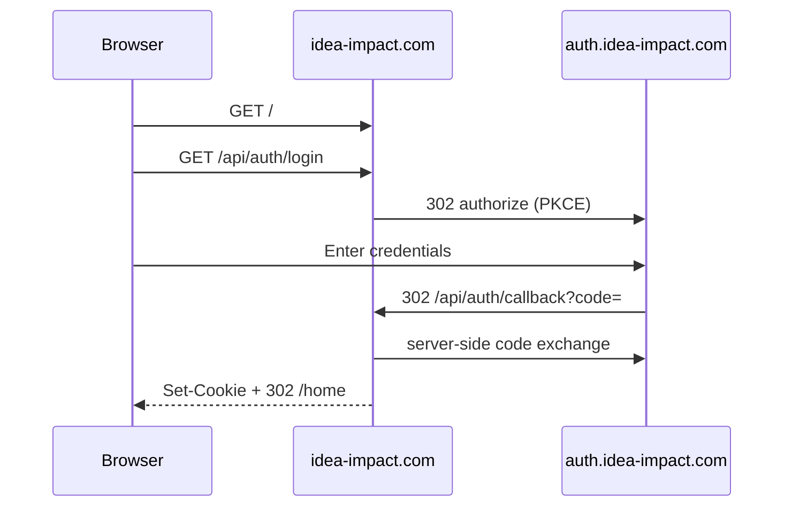

# Keycloak authentication (web-dashboard)

The Next.js dashboard (`web-dashboard`) authenticates operators via **Keycloak OIDC** (authorization code + PKCE). Passwords are entered on **auth.idea-impact.com** only. Session tokens are stored in httpOnly cookies (`dd_access_token`, `dd_refresh_token`).

## Defaults (realm import)

On **first Keycloak start** with an empty `keycloak_data` volume, Compose imports [`infra/keycloak/realm-platform.json`](../infra/keycloak/realm-platform.json):

| Setting | Value |
|---------|-------|
| Realm | `platform` |
| Client ID | `web-dashboard` (confidential) |
| Client secret | `web-dashboard-dev-secret` |
| Dev user | `operator` / `operator-dev-password` |

Realm import runs **once**. Changing `realm-platform.json` later does not update an existing Keycloak database.

## Environment variables

Set in `.env` (loaded by Compose `env_file` on `web-dashboard` and `keycloak`):

| Variable | Purpose |
|----------|---------|
| `KEYCLOAK_BASE_URL` | Internal Keycloak URL (Compose sets `http://keycloak:8080` on `web-dashboard`) |
| `KEYCLOAK_REALM` | Realm name (default `platform`) |
| `KEYCLOAK_CLIENT_ID` | OAuth client (default `web-dashboard`) |
| `KEYCLOAK_CLIENT_SECRET` | Must match the **Credentials** tab for `web-dashboard` in Keycloak |
| `KEYCLOAK_ISSUER` | Public JWT issuer (production: `https://auth.idea-impact.com/realms/platform`; local: `http://localhost:8180/realms/platform`) |

**Important:** Never set `KEYCLOAK_CLIENT_SECRET=` with no value in `.env`. Docker Compose passes an empty string and overrides compose defaults, which breaks login.

| `APP_PUBLIC_ORIGIN` | Public site origin for login/logout redirects (e.g. `https://idea-impact.com`). **Required on VPS** behind Traefik; without it, successful sign-in can redirect to `http://localhost:3000`. Falls back to `VPS_PUBLIC_URL` if unset. |

## Login flow (OIDC + PKCE)

Public landing at `/` is **plain HTML** (Route Handler — no React, no `/_next/static` on first load). **Continue to RagTag** → `/api/auth/login` → redirect to Keycloak at **auth.idea-impact.com**. After credentials, Keycloak returns to `/api/auth/callback`; the dashboard sets cookies and redirects to `next` (default `/home`).



Implementation:

- [`apps/web-dashboard/app/route.ts`](../apps/web-dashboard/app/route.ts) — static HTML landing (zero-JS)
- [`apps/web-dashboard/lib/public/landingPage.ts`](../apps/web-dashboard/lib/public/landingPage.ts) — landing HTML builder
- [`apps/web-dashboard/app/login/route.ts`](../apps/web-dashboard/app/login/route.ts) — redirect to OIDC start (middleware `?next=` entry)
- [`apps/web-dashboard/app/api/auth/login/route.ts`](../apps/web-dashboard/app/api/auth/login/route.ts) — PKCE authorize redirect
- [`apps/web-dashboard/app/api/auth/callback/route.ts`](../apps/web-dashboard/app/api/auth/callback/route.ts) — code exchange + cookies
- [`apps/web-dashboard/lib/server/keycloakOidc.ts`](../apps/web-dashboard/lib/server/keycloakOidc.ts)
- [`apps/web-dashboard/lib/server/keycloakRefreshGrant.ts`](../apps/web-dashboard/lib/server/keycloakRefreshGrant.ts) — BFF session refresh

**Password grant removed.** Automation uses Keycloak token endpoint directly (client credentials or service account):

```bash
curl -sS -X POST 'https://auth.idea-impact.com/realms/platform/protocol/openid-connect/token' \
  -d 'grant_type=client_credentials' \
  -d 'client_id=<service-account-client>' \
  -d 'client_secret=<secret>'
```

**Failed browser login:** callback redirects to `/?signin=failed` (generic message only — no raw OAuth or password-related text in the URL).

Post-deploy smoke test:

```bash
./scripts/verify-landing-auth.sh https://idea-impact.com
```

### Existing Keycloak volume (OIDC migration)

Realm import runs once. After deploy, run on VPS:

```bash
COMPOSE_FILE=docker-compose.vps.yml:docker-compose.traefik.yml ./scripts/keycloak-enable-oidc.sh
```

Or update client `web-dashboard` manually: standard flow on, direct access grants off, redirect URI `https://idea-impact.com/api/auth/callback`, PKCE S256.

## Common error: Invalid Keycloak client secret

The dashboard maps Keycloak `unauthorized_client` / invalid client credentials to:

> Invalid Keycloak client secret (must match the web-dashboard client in Keycloak).

**Cause:** `KEYCLOAK_CLIENT_SECRET` in the running `web-dashboard` container does not match the secret stored in Keycloak for client `web-dashboard`.

Typical scenarios:

1. Production `.env` uses a rotated hex secret while Keycloak still has the realm-import default.
2. Keycloak admin UI secret was changed but `.env` was not updated.
3. Empty `KEYCLOAK_CLIENT_SECRET=` in `.env` (see above).

**Fix:** Align both sides, or reset Keycloak (below).

## Fresh deploy reset (wipe IdP + Postgres)

Use when you want a clean slate and do not need existing users, runs, or uploads.

**Preserves `ollama_models`** (avoids re-pulling multi-GB models). Do **not** use `docker compose down -v` blindly.

### VPS (idea-impact.com)

Host swap (64 GB default) and routine deploy: [`docs/vps-host-setup.md`](vps-host-setup.md). Use `./scripts/vps-deploy.sh` for normal bring-up/redeploy (swap + compose + retrieval seeds). **Host swap is not removed** during the volume wipe below.

**Normal redeploy** (no database wipe):

```bash
cd /opt/agent-x
./scripts/vps-deploy.sh
```

**Fresh deploy reset** (wipe IdP + Postgres):

```bash
cd /opt/agent-x
export COMPOSE_FILE=docker-compose.vps.yml:docker-compose.traefik.yml

# 1. Align secret with realm import
grep KEYCLOAK .env
# KEYCLOAK_CLIENT_SECRET=web-dashboard-dev-secret
# KEYCLOAK_REALM=platform
# KEYCLOAK_CLIENT_ID=web-dashboard
# KEYCLOAK_ISSUER=https://auth.idea-impact.com/realms/platform
# APP_PUBLIC_ORIGIN=https://idea-impact.com

# 2. Stop stack (no -v)
./scripts/compose-down.sh

# 3. Remove state volumes except ollama_models (host /swapfile is unchanged)
docker volume ls --filter label=com.docker.compose.project=agent-x --format '{{.Name}}'
docker volume rm \
  agent-x_keycloak_data agent-x_postgres_data agent-x_redis_data \
  agent-x_minio_data agent-x_prometheus_data agent-x_grafana_data \
  agent-x_searxng_cache agent-x_veeva_suite_worker_storage \
  agent-x_reranker_bge_hf agent-x_reranker_jina_hf agent-x_reranker_colbert_hf

# 4. Ordered bring-up
docker compose up -d postgres    # wait healthy
docker compose up -d keycloak    # wait healthy (~90s)
docker compose up -d --build

# 5. Verify OIDC discovery (production)
curl -fsS 'https://auth.idea-impact.com/realms/platform/.well-known/openid-configuration' | head -c 200

# Local Keycloak token (client credentials — password grant disabled)
curl -sS -X POST 'http://127.0.0.1:8180/realms/platform/protocol/openid-connect/token' \
  -H 'Content-Type: application/x-www-form-urlencoded' \
  --data-urlencode 'grant_type=client_credentials' \
  --data-urlencode 'client_id=web-dashboard' \
  --data-urlencode 'client_secret=web-dashboard-dev-secret'
# Expect JSON with access_token when service accounts enabled; otherwise configure a service-account client.
```

### Local dev

Same pattern; use default `docker-compose.yml` and [`README.md`](../README.md) “Fresh database” section:

```bash
./scripts/compose-down.sh
docker volume rm <project>_keycloak_data <project>_postgres_data ...  # keep ollama_models
./scripts/compose-up.sh -d postgres
./scripts/compose-up.sh -d keycloak
./scripts/compose-up.sh -d --build
```

## Production security headers (Netskope / SWG)

The dashboard sets HTTP headers on all routes via [`apps/web-dashboard/next.config.js`](../apps/web-dashboard/next.config.js) and [`apps/web-dashboard/lib/securityHeaders.js`](../apps/web-dashboard/lib/securityHeaders.js). Posture matches **problematticsolutions.com** on measurable signals: `HSTS`, `X-Content-Type-Options`, `X-XSS-Protection`, plus `X-Frame-Options` and `Referrer-Policy` on idea-impact. There is **no** `Content-Security-Policy` or `Permissions-Policy`. Typography is self-hosted via `@fontsource/oswald` and `@fontsource/jetbrains-mono` (no `fonts.googleapis.com` on login). `X-Powered-By` is disabled. The external Problemattic Solutions footer link is not rendered on any route (login or authenticated shell). The login page does not render the hazard stripe or “internal access” copy (credential form remains on `/login` only).

After each `web-dashboard` deploy to idea-impact.com, verify from any host:

```bash
# Unauthenticated root → plain HTML landing (no _next/static, no redirect to login)
curl -sSI https://idea-impact.com/ | grep -iE '^HTTP/|^location:|^content-type:'
curl -sS https://idea-impact.com/ | grep -c '_next/static' || true
curl -sS https://idea-impact.com/ | grep -ci 'type="password"' || true
# Expect: HTTP 200, 0 _next/static references, 0 password fields

# Or run the full smoke suite:
./scripts/verify-landing-auth.sh https://idea-impact.com

# Login starts OIDC on auth subdomain
curl -sSI 'https://idea-impact.com/login' | grep -i location
# Expect: Location contains auth.idea-impact.com
# Expect: strict-transport-security, x-frame-options, x-content-type-options, referrer-policy, x-xss-protection
# Must NOT see: content-security-policy, permissions-policy, x-powered-by

curl -sSI https://idea-impact.com/login | grep -iE 'content-security|permissions-policy'
# Expect: no output

# No Google Fonts in bundled CSS (pick href from /login HTML)
CSS=$(curl -sS https://idea-impact.com/login | grep -oE '/_next/static/css/[^"'\'' ]+\.css' | head -1)
curl -sS "https://idea-impact.com${CSS}" | grep -c fonts.googleapis.com || true
# Expect: 0
```

Confirm login HTML has no `problematticsolutions.com` link:

```bash
curl -sS https://idea-impact.com/login | grep -c problematticsolutions.com || true
# Expect 0
```

Authenticated pages are mostly client-rendered; after signing in, confirm in browser DevTools (Elements) on `/` or any tool page: no `problematticsolutions.com`, and Web Search results use copy/open controls instead of `<a href="https://…">` for result URLs.

Scanner probe paths must return plain 404, not login HTML or redirects:

```bash
for p in /site.webmanifest /manifest.json /robots.txt; do
  echo "=== $p ==="
  curl -sSI "https://idea-impact.com${p}" | grep -iE '^HTTP/|^content-type:|^location:'
  curl -sS "https://idea-impact.com${p}"
  echo
done
# Expect each: HTTP 404, Content-Type: text/plain; charset=utf-8, body "Not Found"
# Must NOT see: Location: /login or Content-Type: text/html

curl -sSI https://idea-impact.com/favicon.ico | grep -iE '^HTTP/|^content-type:|^location:'
# Expect: HTTP/2 200 (or 304), image/* — not 404 HTML, no Location: /login

curl -sSI https://idea-impact.com/icon.svg | grep -iE '^HTTP/|^content-type:|^location:'
# Expect: HTTP/2 200, image/svg+xml — no Location: /login

curl -sSI https://idea-impact.com/apple-touch-icon.png | grep -iE '^HTTP/|^content-type:|^location:'
# Expect: HTTP/2 200, image/png — no Location: /login

# After sign-in (browser or curl with valid credentials): Location must stay on idea-impact.com
# Expect: never http://localhost:3000 in redirect Location headers
grep APP_PUBLIC_ORIGIN .env
# Expect: APP_PUBLIC_ORIGIN=https://idea-impact.com (or VPS_PUBLIC_URL set; compose maps both into web-dashboard)
```

If corporate Netskope still blocks browser traffic after headers are present, see **[netskope-idea-impact-browser.md](netskope-idea-impact-browser.md)** for required tenant policies (URL list, steering bypass, SSL DND, DLP waiver) and the browser verification checklist.

## Post-reset hardening

1. Change `operator-dev-password` in Keycloak admin (`http://127.0.0.1:8180` on VPS via SSH tunnel).
2. Rotate `KEYCLOAK_CLIENT_SECRET` in Keycloak **Credentials** + `.env`, then recreate `web-dashboard`.
3. Do not commit production secrets to git; keep live values in VPS `.env` only.

## Related files

- [`docs/vps-host-setup.md`](vps-host-setup.md) — host swap and `vps-deploy.sh`
- [`docker-compose.yml`](../docker-compose.yml) — Keycloak service + `web-dashboard` env
- [`apps/web-dashboard/middleware.ts`](../apps/web-dashboard/middleware.ts) — route gate
- [`apps/web-dashboard/lib/auth/verifyAccessToken.ts`](../apps/web-dashboard/lib/auth/verifyAccessToken.ts) — JWT verification
- [`apps/web-dashboard/lib/securityHeaders.js`](../apps/web-dashboard/lib/securityHeaders.js) — production HTTP security headers
