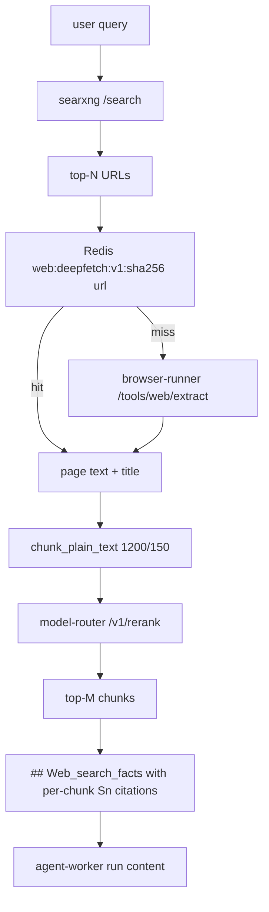

# Plan: SearXNG deep-fetch (Phase 1) → ColBERT (Phase 2)

## Overview

Phase 1 is the high-ROI move and lands in 3 small PRs using parts already running in Compose (browser-runner, model-router `/v1/rerank`, Redis, BGE-v2-m3). Phase 2 adds ColBERT in two stages: a drop-in TEI-shaped reranker first, then optional full multi-vector retrieval later.

## Target flow (Phase 1 end-state)

---

## Phase 1 — SearXNG page-fetch + chunk + rerank

### 1A. Shared chunker + Redis cache helper (small PR)

- Lift `chunk_plain_text` (currently [apps/ingestion-worker/ingestion/extract_text.py](apps/ingestion-worker/ingestion/extract_text.py) line 13) into a new module `apps/agent-worker/worker/text_chunking.py`. Same 7-line implementation; size/overlap defaults stay tunable.
- New `apps/agent-worker/worker/web_cache.py`:
  - Key: `web:deepfetch:v1:{sha256(final_url)}` → JSON `{text, title, final_url, fetched_at}`.
  - Negative-result key per host on transport failure, TTL ~600s.
  - TTL via `WEB_DEEPFETCH_CACHE_TTL_SEC` (default 21600).
- Tests using `fakeredis` in `apps/agent-worker/tests/test_web_cache.py`.

### 1B. Deepfetch orchestrator (medium PR)

- New `apps/agent-worker/worker/web_deepfetch.py` exposing:
  - `async deepfetch_urls(urls, *, run_id) -> list[FetchedPage]`
  - Calls `POST {BROWSER_RUNNER_URL}/tools/web/extract` ([apps/browser-runner/tools/main.py](apps/browser-runner/tools/main.py) line 226) with `render_js=false` first; optional one-shot `render_js=true` fallback when extracted text < min_chars.
  - Concurrency via `asyncio.Semaphore(WEB_DEEPFETCH_CONCURRENCY)`.
  - Hard wall-clock budget via `WEB_DEEPFETCH_BUDGET_MS`; whatever isn't back in time is dropped.
  - Per-URL cache lookup/write via 1A.
  - Returns `FetchedPage{url, final_url, title, text, source: "live"|"cache"|"skipped"}`.
- New env in [docker-compose.yml](docker-compose.yml) under the `agent-worker` block only:
  - `WEB_DEEPFETCH_ENABLED` (default `0`, flip to `1` after smoke).
  - `WEB_DEEPFETCH_TOP_URLS` (default `6`).
  - `WEB_DEEPFETCH_CONCURRENCY` (default `4`).
  - `WEB_DEEPFETCH_PER_URL_TIMEOUT_SEC` (default `8`).
  - `WEB_DEEPFETCH_BUDGET_MS` (default `12000`).
  - `WEB_DEEPFETCH_MIN_CHARS` (default `200`).
  - `WEB_DEEPFETCH_RENDER_JS_FALLBACK` (default `0`).
  - `WEB_DEEPFETCH_CACHE_TTL_SEC` (default `21600`).
- Tests `apps/agent-worker/tests/test_web_deepfetch.py` mocking httpx + fakeredis: concurrency cap, budget cutoff, cache hit/miss, min_chars fallback.

### 1C. Chunk + rerank + richer prompt block (medium PR)

- Edit [apps/agent-worker/worker/web_search_context.py](apps/agent-worker/worker/web_search_context.py):
  - After `search-runner` returns (line 91-100), when `WEB_DEEPFETCH_ENABLED=1`:
    1. `deepfetch_urls([r['url'] for r in rows[:WEB_DEEPFETCH_TOP_URLS]])`.
    2. Chunk each page via `chunk_plain_text(text, size=1200, overlap=150)`.
    3. Flatten to `[(source_idx, chunk_text, page_meta), ...]`.
    4. `POST {MODEL_ROUTER_URL}/v1/rerank` with `reranker_id=WEB_DEEPFETCH_RERANKER_ID` (default `tei_bge`) and the chunk texts.
    5. Keep top `WEB_DEEPFETCH_TOP_CHUNKS` (default `8`).
  - New `format_web_search_chunks_block(chunks)` emitting the same `## Web_search_facts` header (so [apps/agent-worker/worker/workflows/prompts.py](apps/agent-worker/worker/workflows/prompts.py) is unaffected). Each `[Sn]` becomes a chunk row with `Title`, `URL`, and ~500-char excerpt; trailing instruction line preserved verbatim.
  - Fallback: if deepfetch returns zero usable pages, fall through to today's `format_web_search_block` (lines 50-68). Worst case == today.
- Emit `event(rid, 'web.deepfetch.*', ...)` for `request|fetched|reranked|attached|fallback`, mirroring the existing `web.search.*` events.
- Token-budget guard: cap the assembled block at `WEB_DEEPFETCH_BLOCK_MAX_CHARS` (default `5000`) before prepending.
- Tests in `apps/agent-worker/tests/test_web_search_context.py`:
  - deepfetch off → identical bytes to today's block.
  - deepfetch on → new block with `[S1]..[Sn]` chunks.
  - all extracts empty → falls back to snippet block; one `web.deepfetch.fallback` event fired.

### 1D. (Recommended add-on) Fix the worker-path rerank gap

Today the rerankers running in Compose ([reranker-bge](docker-compose.yml) port 8095, [reranker-jina](docker-compose.yml) port 8096) are only exercised by `POST /api/memory/search`; the actual run path in [apps/agent-worker/worker/main.py](apps/agent-worker/worker/main.py) line 148 calls `hybrid_memory_context` ([apps/agent-worker/worker/workflows/common.py](apps/agent-worker/worker/workflows/common.py) line 904) which never reranks. Either:

- Add an internal `POST /api/memory/retrieve` on agent-api that calls `apps/agent-api/app/services/retrieval_v2.retrieve` and have agent-worker use it; or
- Inline the `rerank_rows` call ([apps/agent-api/app/services/retrieval_v2.py](apps/agent-api/app/services/retrieval_v2.py) line 146) after the existing keyword+vector merge in `hybrid_memory_context`.

This is a 1-hour change that makes Phase 2 actually visible end-to-end. Worth landing between 1C and 2A.

---

## Phase 2 — ColBERT

### 2A. ColBERT as a drop-in TEI-shaped reranker (cheap viable form)

- New Compose service `reranker-colbert` (custom Dockerfile under `apps/reranker-colbert/`):
  - FastAPI wrapper around `pylate` (or `RAGatouille`) exposing `POST /rerank` with the **same TEI shape** (`{query, texts, truncate}` → `[{index, score}]`) so [apps/model-router/router/rerank.py](apps/model-router/router/rerank.py) `_rerank_tei` (line 28) works unchanged.
  - Model: `jinaai/jina-colbert-v2` (multilingual, MIT) or `lightonai/GTE-ModernColBERT-v1` (smaller, faster on CPU).
  - Healthcheck + start_period sized for first-pull weight download (mirror reranker-bge block in [docker-compose.yml](docker-compose.yml) lines 113-126).
- Register in:
  - [apps/model-router/router/reranker_catalog.py](apps/model-router/router/reranker_catalog.py) line 17 — add `colbert_jina_v2` with `backend='tei'`, `endpoint='http://reranker-colbert:8097'`.
  - New migration `infra/postgres/init/031_reranker_colbert.sql` that `INSERT … ON CONFLICT DO NOTHING` into `reranker_catalog` (mirror [infra/postgres/init/030_retrieval_v2.sql](infra/postgres/init/030_retrieval_v2.sql) line 86). Also update the bootstrap row list there for fresh DBs.
- Per-agent opt-in already pluggable via `agent_retrieval_config.reranker_id` ([apps/agent-api/app/services/retrieval_config_service.py](apps/agent-api/app/services/retrieval_config_service.py) line 43). No app code changes for chunks/memories rerank.
- Phase 1's deepfetch picks it up by setting `WEB_DEEPFETCH_RERANKER_ID=colbert_jina_v2`.
- A/B: leave defaults at `tei_bge`; flip per-agent (DB) or per-call (`reranker_override` already in `MemorySearch`).
- Tests: extend `apps/model-router/tests/` rerank tests with a stubbed endpoint to assert the new id routes through `_rerank_tei`.

### 2B. ColBERT as a first-class retriever (stretch / deferred)

Hold until 2A is live and we see queries that BGE-v2-m3 / ColBERT-rerank both fail on.

- Choose storage:
  - PLAID/colbert-ai file-based index inside `reranker-colbert` (rebuild on ingest); OR
  - Qdrant 1.10+ multivector collection as a new Compose service.
- New backend in catalog `backend='colbert_retrieve'`; new endpoint `POST /v1/retrieve_late_interaction` on model-router returning `[{source_id, score}]`.
- Add a third candidate list to `_rrf_merge` in [apps/agent-api/app/services/retrieval_v2.py](apps/agent-api/app/services/retrieval_v2.py) line 25.
- Ingestion: second-pass writer in [apps/ingestion-worker/ingestion/consumer.py](apps/ingestion-worker/ingestion/consumer.py) line 170 gated on `INGEST_COLBERT_ENABLED=1`; backfill script under `scripts/`.
- Schema: either a new `colbert_embeddings` table (token vectors as `halfvec[]`) or no Postgres write (external index only). Decision deferred to when this phase is greenlit.

---

## Risks and rollout posture

- Every Phase 1 and 2A knob defaults to off / current behavior. Flip per-env after `scripts/smoke.sh`.
- Phase 1 never makes the web block strictly worse: explicit snippet fallback path.
- Latency budget enforced wall-clock in 1B; agents never wait longer than `WEB_DEEPFETCH_BUDGET_MS` even if browser-runner stalls.
- SSRF: agent-worker calls `browser-runner /tools/web/extract` which already validates public HTTP URLs; we do not bypass to httpx directly.
- Phase 2A is additive (one new catalog row, one new service). Existing rerankers untouched.
- Phase 2B is the only step that mutates schema and Compose footprint meaningfully — gate on Phase 1 + 2A evidence.